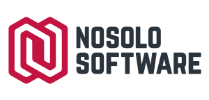

# Taller API on Rails


Este repositorio contiene el código necesario para seguir el taller de **API on Rails** que se
imparte en las *I Jornadas de Software Libre de la Universidad de Granada* celebradas en la ciudad
nazarí los días 27 y 28 de Septiembre de 2018.

Se encuentra organizado en dos ramas distintas:

* La rama `master` contiene el esqueleto básico sobre el cual iremos añadiendo la funcionalidad.
* La rama `api` contiene la aplicación terminada para que sirva como referencia.


## Empleo



En mi empresa, **[NoSoloSoftware](https://nosolosoftware.es)**, estamos buscando talento en
**Granada**, tanto alumnos en prácticas de la universidad como desarrolladores ya expertos. Si
quieres unirte a esta familia (somos ya más de 60 personas en esta aventura) envía tu *CV* a
**[personas@nosolosoftware.es](mailto:personas@nosolosoftware.es)**.


## Requisitos técnicos

1. Sistema operativo Unix
2. Ruby MRI 2.5.1
3. MongoDB 3.2.x


## Instalación

1. Instalar Bundler si no se tiene instalado en el sistema

```
$ gem install bundler
```

2. Instalar con Bundler las dependencias del proyecto

```
$ bundle install
```


## Desarrollo

Una aplicación de Rails puede ser editada usando cualquier editor de código disponible en tu
sistema operativo. Pero si quieres ser un verdadero programador usa **[Vim](https://www.vim.org)**.
Si has decidido usar *Vim* pero no tienes una configuración tuneada, puedes usar
[esta](https://github.com/javierav/dotvim), que es la que yo uso tanto en casa como en el trabajo.

Para que sigas las buenas prácticas de programación de *Ruby* y *Rails* te recomiendo instalar la
gema *Rubocop* para que con el plugin adecuado para tu editor, te vaya indicando qué partes de tu
código pueden ser escritas de una mejor forma. Este proyecto incluye un fichero de configuración con
una guía de estilo ya configurada, por lo que lo único que necesitas es instalar la gema.

```
$ gem install rubocop
```


## Ejecución

Para iniciar el servidor Rails con el API debemos ejecutar

```
$ bundle exec rails s
```

Tras esta operación tendremos disponible nuestro backend en la siguiente dirección local

```
http://localhost:3000
```


## Licencia

Copyright (c) 2018 Javier Aranda - Publicado bajo una licencia [MIT](LICENSE).
